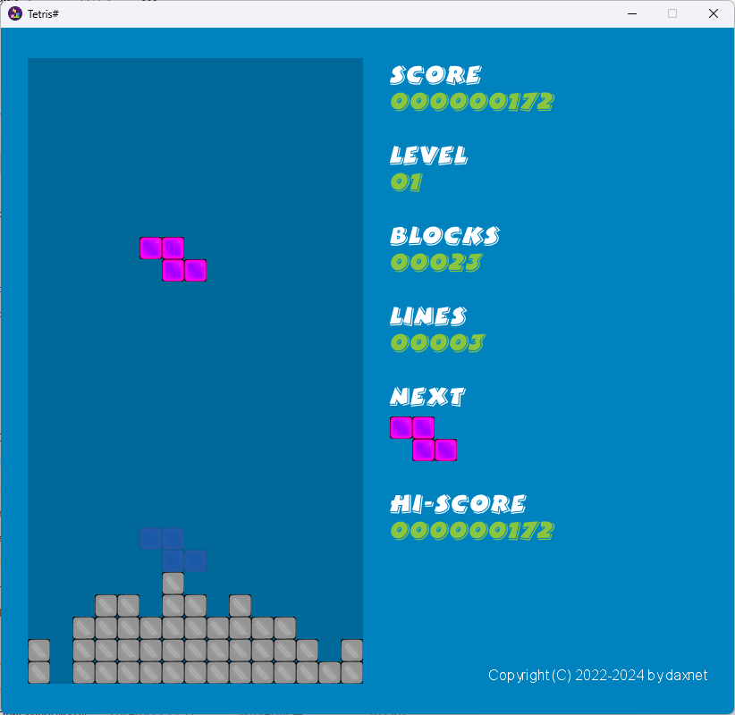
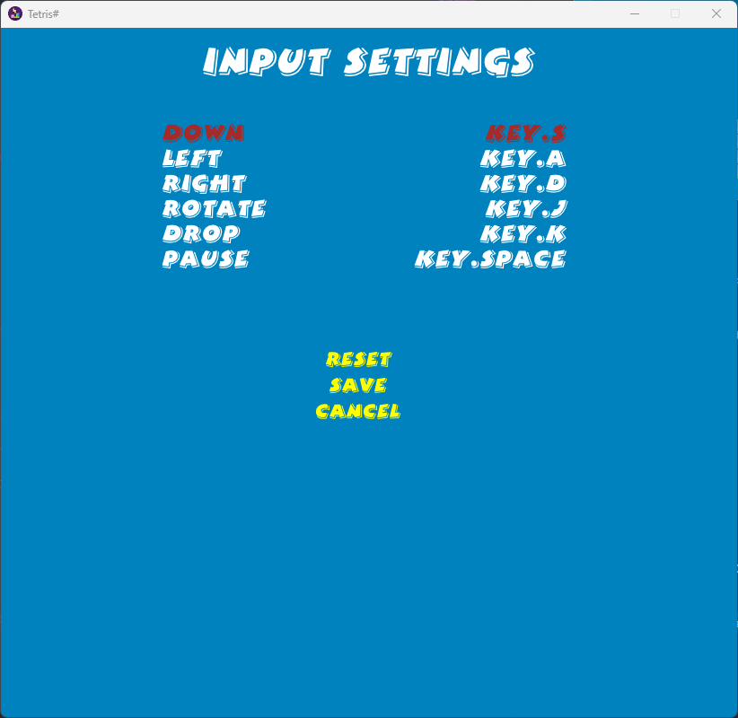

# Tetris Sharp (Revised)
Revised Tetris Game written in C#

(For the old version, please refer to [https://github.com/daxnet/tetris-sharp](https://github.com/daxnet/tetris-sharp))

## New Fetures
Tetris Sharp (Revised) provides the following new features compared with the original version:

- Better look-and-feel
- Block shadowing (navigation)
- Input key customization
- Auto-save
- Low memory usage (Use only 50% memory compared with the original version)

## How to Build

### Prerequisites

- .NET 8 SDK

### Build with Visual Studio 2022

- Go to `src` directory
- Double-click `TetrisSharp.sln`
- Press <kbd>F5</kbd> to debug
- Enjoy

### Build with .NET CLI

- Go to `src` directory
- Execute `dotnet build`
- Artifacts will be generated under `src\bin\Debug\net8.0` folder
- Under the generated folder, double click `TetrisSharp.exe` to run
- Enjoy

## How to Configure Input Keys

1. Run the game
2. On the main scene screen, click `INPUT SETTINGS` menu
3. On the `INPUT SETTINGS` scene screen, press the keys one by one to specify the keys

  

4. Key definitions:
    - `Down`: Moving the current block one step down
    - `Left`: Moving the current block left
    - `Right`: Moving the current block right
    - `Rotate`: Rotates the current block
    - `Drop`: Drops the current block directly to the bottom
    - `Pause`: The key for pausing the game

Note: You can also use a joystick to specify the keys. Tested joystick: `8BitDo M30`.

## How to Save the Current Game

Nothing needs to be done, just exit the game and it will be automatically saved. Next time on the main scene screen, click `LOAD` button to load the game.
